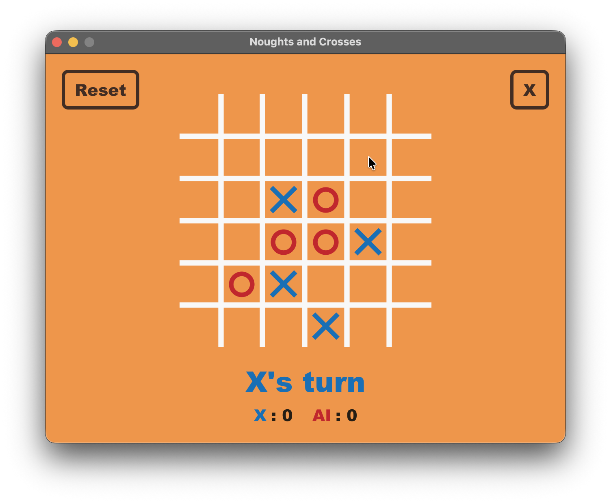

# Noughts and Crosses



A JavaFX implementation of Noughts and Crosses (Tic-Tac-Toe) with a configurable board size and an AI opponent.

## Rules

- The board is an N×N grid. The default is 3x3, but supports up to 6x6.
- Players take turns placing their mark: X always goes first, O is the AI.
- **Win condition:** get `n` marks in a row, column, or diagonal, where:
  - `n = size` for grids of size 4 or smaller (the full row must be filled)
  - `n = size − 2` for grids larger than 4 (e.g. a 6×6 board requires 4 in a row)
- If the board fills with no winner, the game is a draw.
- A running score is tracked across matches.

## AI

The opponent uses the **minimax algorithm** to search the game tree and pick the optimal move.

### Alpha-beta pruning
Applied throughout the search: branches that cannot influence the final decision are cut early, significantly reducing the number of nodes evaluated.

### Search depth
The search depth is calculated dynamically based on the number of remaining squares, so the AI searches deeper in the endgame when the tree is smaller, and shallower at the start of large boards where exhaustive search would be too slow.

### Heuristic evaluation
When the maximum depth is reached before a terminal state, a heuristic is used to help the AI understand what state the board is in. The heuristic scores a position by comparing each player's number of *near-wins* (when the player is one move away from winning). A higher near-win count for the AI relative to the opponent scores positively. The AI also uses near-win count as a tiebreaker when choosing between moves of equal score, preferring moves that reduce the opponent's threats.

## Running

Requires Java 21.0.2 and Maven.

```
mvn clean javafx:run
```
